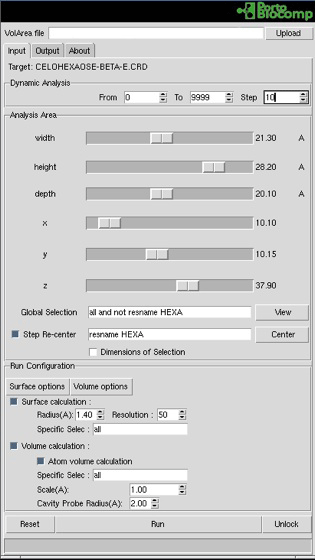
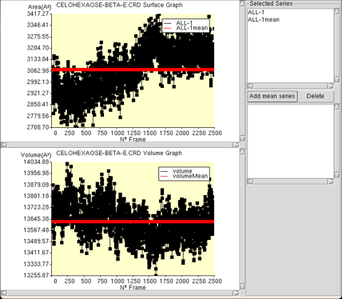
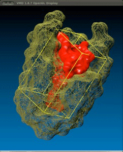
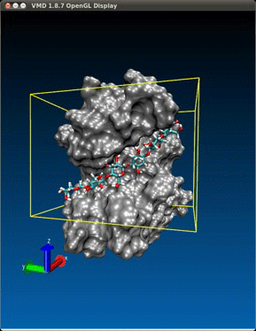
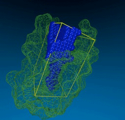
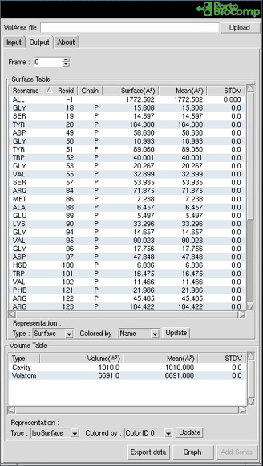

# Introduction
VolArea is a plug-in of the widely spread molecular graphics software Visual Molecular Dynamics (VMD), which allows the calculation of the volume as well as the surface area of any chemical structure.

The surface area can be used also to map or calculate the exposed area of the structure to the solvent or to another chemical structure. This is particularly useful to characterize protein:ligand complexes or corresponding binding sites, as well as protein:protein interfaces. The volume algorithm can be used to predict the space occupied by any chemical structure as well as that of cavities, such as tunnels, clefts, etc.

Running VolArea only requires a few instructions from the user that are managed by a very intuitive graphical interface. The results of the calculations are presented in two different sections: one is devoted to the surface area of the structure under study and the other to its volume. These values can be analyzed in three different ways: 1. using the VMD graphical interface window 2. in an xy plot and 3. in other softwares by exporting the data in txt format.

## Minimum Requirements

Operating System: macOS, Linux or Windows
Visual Molecular Dynamics (VMD) 1.9.1 or later

## Installation

You could install VolArea through [vmdStore](https://github.com/portobiocomp/vmdStore) (Recommended).

## Contacts
If you have any suggestion of new features, please contact us: nscerque@fc.up.pt

## Citation
Ribeiro, J. V., Tamames, J. A. C., Cerqueira, N. M. F. S. A., Fernandes, P. A. and Ramos, M. J. (2013), Volarea – A Bioinformatics Tool to Calculate the Surface Area and the Volume of Molecular Systems. Chem Biol Drug Des, 82: 743–755.

## DOI
http://doi.org/10.1111/cbdd.12197
